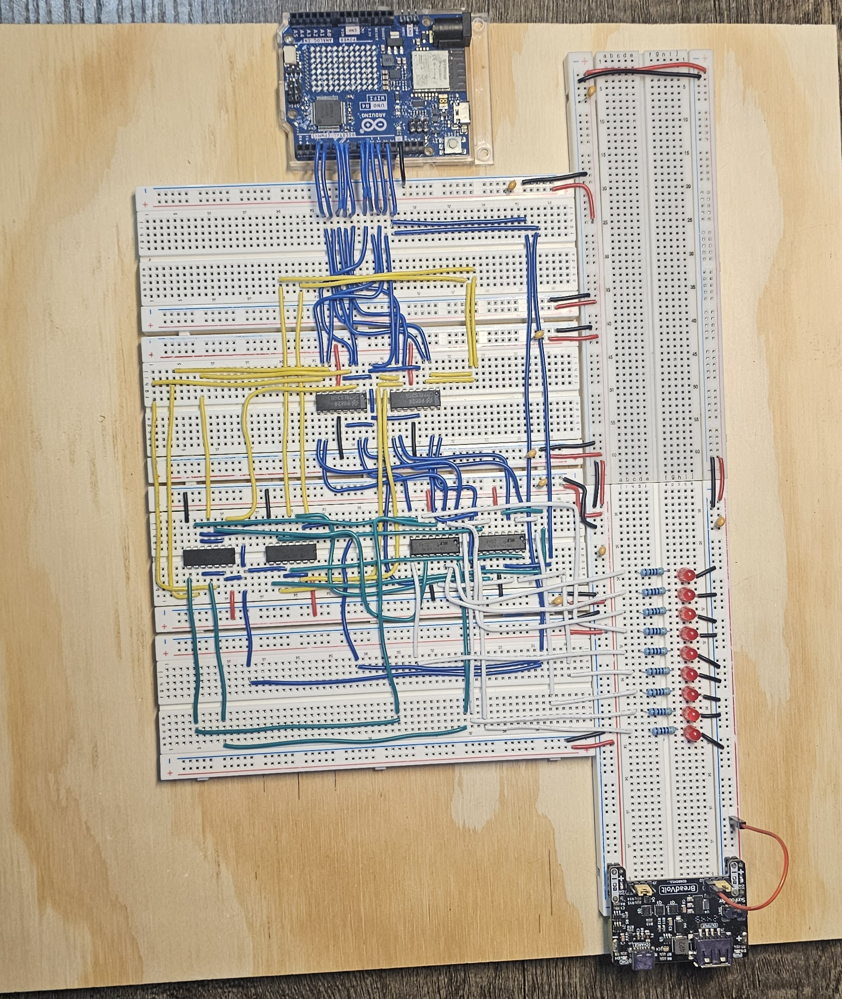
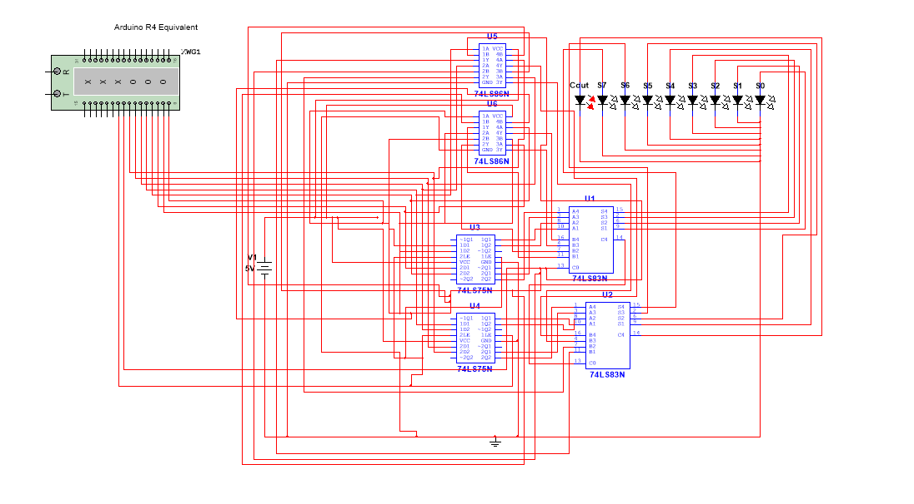

# Arduino-Assisted 8-Bit TTL Adder/Subtractor
## Current Version: 2.0

Version 2.0 expands the original 8-bit adder by adding two's complement subtraction, Arduino-controlled latching, automated test sequence, and power-rail bypass capacitors.

## Project Overview - Version 2.0

This project is an Arduino-assisted 8-bit TTL circuit that perform binary addition and two's-complement subtraction. Two 74LS75 ICs store operand A, two 74LS86 ICs conditionally invert operand B, and two cascaded 74LS83 ICs perform the arithmetic. The Arduino supplies the operands and the control signals, while the TTL hardware performs the calculations. Eight LEDs display the 8-bit result, and a ninth LED displays carry-out.  

## Physical Circuit


## Demonstration Video

[Watch the version 2.0 demonstration](https://github.com/AntonioArceEE/8-Bit-TTL-Adder-Subtractor/releases/download/v2.0/Antonio_Arce_8_Bit_Adder_Subtractor_Demonstration.mp4)

## How It Works

- Two 74LS75 ICs store operand A.
- Two cascaded 74LS83 ICs perform 8-bit arithmetic.
- Two 74LS86 ICs conditionally invert operand B.
- ADD/SUB also controls the least-significant caryy-in.
- Nine LEDs display COUT and S7-S0.
- The Arduino supplies operands and control signals.

## Version 2.0 Functional Logic Schematic

The schematic below represents the functional logic and signal connections of the adder/subtractor. The physical circuit also includes power-rail bypass (decoupling) capacitors to reduce switching noise and improve power stability. These capacitors are omitted from the functional logic schematic for clarity.



### Downloadable Multisim File

[Download the version 2.0 Multisim project](8-Bit_TTL_Adder_Subtractor_V2.ms14)

### Arduino Source Code

The Arduino control code was developed with AI assistance based on circuit architecture, control sequence, and functional requirements I defined. I integrated and tested the code with physical TTL circuit and verified its operation using the documented test cases.

[View the version 2.0 Arduino code]

# Version 1.0 - Original Prototype

The following section documents the original addition-only version of the project.

## Project Overview

I designed, simulated, constructed, and tested an 8-bit binary adder using TTL logic ICs, two 74LS75 latches, two cascaded 74LS83 adders, and an Arduino Uno R4 input interface.

The Arduino supplies repeatable 8-bit input patterns, but it does not perform the arithmetic. The TTL circuit stores operand A, receives operand B through the shared input bus, and displays the result using eight sum LEDs and a carry-out LED.

## Objectives

* Design and construct a working 8-bit binary adder.
* Store one 8-bit operand using 74LS75 latches.
* Cascade two 4-bit adders to perform 8-bit arithmetic.
* Use an Arduino to replace unreliable mechanical DIP switches.
* Test carry propagation, overflow, and different binary input patterns.
* Compare the physical circuit with the Multisim simulation.

## Components

* Arduino Uno R4
* Two solderless breadboards
* 2 × 74LS75N four-bit latch ICs
* 2 × 74LS83N four-bit binary adder ICs
* Eight sum LEDs
* One carry-out LED
* Individual LED current-limiting resistors
* Active-HIGH momentary pushbutton
* 330 Ω, 1/2-watt enable pull-down resistor
* 2000 Ω, 1/2-watt led resistor
* Regulated 5 V power supply
* Jumper wires
* USB connection for the Arduino Serial Monitor
* Digital Multimeter

## Circuit Operation

Arduino pins 3 through 10 generate an 8-bit parallel input bus.

| Arduino pin | Data bit |
| ----------: | -------- |
|           3 | D0 / LSB |
|           4 | D1       |
|           5 | D2       |
|           6 | D3       |
|           7 | D4       |
|           8 | D5       |
|           9 | D6       |
|          10 | D7 / MSB |

The shared input bus connects to the D inputs of the 74LS75 latches and to the live B inputs of the adder.

The operating sequence is:

1. Enter operand A through the Arduino Serial Monitor.
2. Press and release the load button to store A in the 74LS75 latches.
3. Enter operand B through the same input bus.
4. Read the result from the eight sum LEDs and carry-out LED.

The latch Q outputs provide the stored A operand. The current value on the shared bus provides the B operand.

## Shared-Bus Behavior

Immediately after A is latched, the shared bus still contains A. During this short period, the LEDs display A + A. When B is sent, the display updates to the intended A + B result.

This is a valid intermediate result caused by the shared-bus design. The LED output is not stored or fed back into the adder.

## Carry Operation

The two 74LS83 adders are cascaded to form an 8-bit arithmetic circuit. The carry output from the lower four-bit stage connects to the carry input of the upper four-bit stage.

The initial carry-in is tied to logic LOW. A separate LED displays the final carry-out.

## Power-Up Behavior

The 74LS75 latches do not include a power-on reset in this design. Their initial outputs are therefore undefined when power is first applied.

## Multisim Simulation

I simulated the circuit in Multisim before completing the physical breadboard version.

The original simulation used an eight-position DIP switch. The updated simulation uses a Word Generator to represent the eight Arduino GPIO outputs. Only Word Generator outputs 0 through 7 are used.

The simulation and physical circuit follow the same sequence:

```text
Send A → Latch A → Send B → Read Result
```
### Simulation Files

- [Download the Multisim simulation](8-Bit-Adder-MultiSim-Simulation.ms14)
- [View the full Multisim schematic](8-Bit-Adder-MultiSim-Simulation-Schematic.png)


## Test Results

The circuit was tested using representative binary patterns rather than every possible input combination.

| A          | B          | Expected output | Result |
| ---------- | ---------- | --------------- | ------ |
| `00000001` | `00000001` | `0 00000010`    | Passed |
| `00001111` | `00000001` | `0 00010000`    | Passed |
| `01010101` | `10101010` | `0 11111111`    | Passed |
| `10010000` | `10010000` | `1 00100000`    | Passed |
| `11110000` | `00010000` | `1 00000000`    | Passed |
| `11111111` | `00000001` | `1 00000000`    | Passed |

The first output bit in the table represents carry-out, followed by the eight sum bits.

## Troubleshooting and Improvements

During construction, I encountered several problems that were not as noticeable in simulation:

* Mechanical DIP switches required too much pressure and disturbed nearby jumper wires.
* Some jumper wires made unreliable contacts.
* The Arduino and TTL circuit required a shared common ground.
* A digital multimeter was used to verify the 5 V rails, common-ground continuity, jumper connections, and latch-enable voltage levels.
* The shared latch-enable line was not initially held at a reliable TTL LOW level.
* A 330 Ω pull-down resistor produced more consistent enable operation.
* LED current-limiting resistors reduced output loading.
* Replacing the DIP switches with Arduino-generated inputs improved test repeatability.

These problems helped me practice tracing signals, checking logic levels, verifying power and ground, and separating wiring problems from logic-design problems.

## Design Constraints

* The dense solderless-breadboard layout is sensitive to physical movement.
* The latch has no automatic power-on reset.
* The shared input bus produces a temporary A + A result after A is loaded.
* Carry-in is currently fixed at logic LOW.
* The Arduino generates test inputs, while the TTL ICs perform the arithmetic.

## Design Process

I first constructed and verified a smaller 2-bit prototype before scaling the design to eight bits. This reduced debugging complexity and helped confirm the latch and adder connections before completing the larger circuit.

## Future Improvements

Possible future improvements include:

* Use the Arduino to control the latch-enable signal automatically.
* Have the Arduino read and verify the TTL outputs.
* Add a power-on reset circuit.
* Rebuild the circuit on perfboard for stronger mechanical connections.
* Improve wire organization and signal labeling.
* Add subtraction or additional logic operations.
## Video Demonstration

-[Watch or download the 8-bit adder hardware demonstration](https://github.com/AntonioArceEE/8-Bit-Binary-Adder/releases/download/v1.0/Arduino-Assisted.8-Bit.Binary.Adder.mp4)

-The video demonstrates the Arduino input interface, TTL hardware, latch operation, shared-bus behavior, sum outputs, carry propagation, and four verified arithmetic tests.
